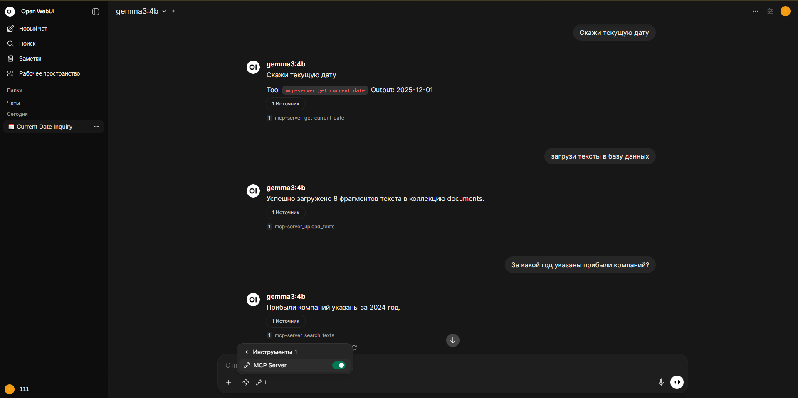
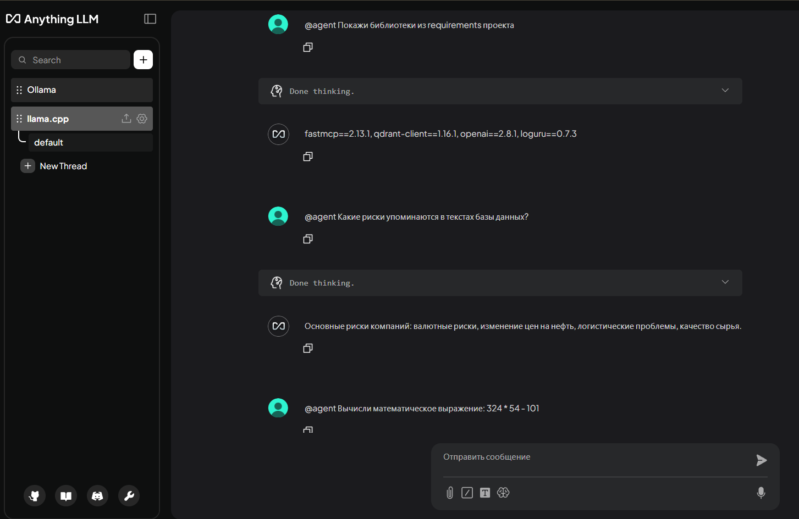

# Docker Compose WebUI LLM Examples

**Примеры запуска библиотек для инференса LLM в связке с веб-интерфейсами через Docker Compose**  

Репозиторий является дополнением к Google Colab ноутбуку `Docker Compose, LLM, WebUI`  
<a href="https://colab.research.google.com/drive/1P3rB1s_bvUe7Zf3VE_IOTInH67N4i5b9"></a> репозитория https://github.com/sergey21000/ml-dl-notebooks


<details>
<summary><b>Скриншот использования MCP + RAG в Open WebUI</b></summary>


</details>

<details>
<summary><b>Скриншот использования MCP + RAG в AnythingLLM</b></summary>


</details>


## 📋 Содержание

- 🏗 [Стек технологий](#-стек-технологий)
- 🐳 [Требования](#-требования)
- 🚀 [Быстрый старт](#-быстрый-старт)
- 📖 [Примеры запуска](#-примеры-запуска)
  - [AnythingLLM + llama.cpp](#anythingllm--llamacpp)
  - [AnythingLLM + Ollama](#anythingllm--ollama)
  - [AnythingLLM + vLLM](#anythingllm--vllm)
  - [Open WebUI + llama.cpp](#open-webui--llamacpp)
  - [Open WebUI + Ollama](#open-webui--ollama)
  - [Open WebUI + vLLM](#open-webui--vllm)
- 🛠 [Конфигурация библиотек](#-конфигурация-библиотек)
  - [AnythingLLM](#anythingllm)
  - [Open WebUI](#open-webui)
  - [llama.cpp](#llamacpp)
  - [Ollama](#ollama)
  - [vLLM](#vllm)
  - [Qdrant](#qdrant)
  - [Infinity](#infinity)
- 🤖 [MCP](#-mcp)
  - [MCP + Open WebUI](#mcp--open-webui)
  - [MCP + AnythingLLM](#mcp--anythingllm)
  - [Скрипты для проверки MCP сервера](#скрипты-для-проверки-mcp-сервера)
- ⚠️ [Решение проблем](#-решение-проблем)
- 📁 [Структура данных](#-структура-данных)
- ▶️ [Команды Docker Compose](#-команды-docker-compose)
- 🔗 [Различные ссылки](#-различные-ссылки)
  - [vLLM](#vllm-1)
  - [Qdrant](#qdrant-1)
  - [Infinity](#infinity-1)
  - [MCP](#mcp)


## 🏗 Стек технологий

Список используемых библиотек:
- [**AnythingLLM**](https://github.com/Mintplex-Labs/anything-llm) - веб-интерфейс для работы с LLM
- [**Open WebUI**](https://github.com/open-webui/open-webui) - веб-интерфейс для работы с LLM
- [**llama.cpp**](https://github.com/ggml-org/llama.cpp) - инференс LLM моделей
- [**Ollama**](https://github.com/ollama/ollama) - инференс LLM моделей
- [**vLLM**](https://github.com/vllm-project/vllm) - инференс LLM моделей
- [**Qdrant**](https://github.com/qdrant/qdrant) - векторная база данных
- [**Infinity**](https://github.com/michaelfeil/infinity) - инференс моделей для получения эмбеддингов
- [**FastMCP**](https://github.com/jlowin/fastmcp) - библиотека для создания приложений MCP
- [**OpenAI Python**](https://github.com/openai/openai-python) - отправка запросов к серверам для инференса моделей
- [**Loguru**](https://github.com/Delgan/loguru) - для вывода логов вместо print()

LLM модели:
- [bartowski/google_gemma-3-4b-it-GGUF](https://huggingface.co/bartowski/google_gemma-3-4b-it-GGUF)  
- [Qwen/Qwen3-0.6B](https://huggingface.co/Qwen/Qwen3-0.6B)  

Модель эмбедингов: 
- [Alibaba-NLP/gte-multilingual-base](https://huggingface.co/Alibaba-NLP/gte-multilingual-base)  


## 🐳 Требования

**1) Docker + Docker Compose**

- `Docker Desktop`  
https://docs.docker.com/get-started/introduction/get-docker-desktop/  
или
- `Docker Engine + Docker Compose`  
https://docs.docker.com/engine/install/  
https://docs.docker.com/compose/install/  

Быстрая установка Docker + Docker Compose на Linux
```sh
sudo apt-get update
curl -fsSL https://get.docker.com | sudo sh
sudo systemctl enable --now docker
sudo usermod -aG docker $USER
newgrp docker
```

**2) NVIDIA Container Toolkit (опционально)**

Для работы контейнеров на видеокартах NVIDIA нужно установить NVIDIA Container Toolkit  
https://docs.nvidia.com/datacenter/cloud-native/container-toolkit/latest/install-guide.html

Быстрая установка NVIDIA Container Toolkit на Linux
```sh
sudo apt-get update && sudo apt-get install -y --no-install-recommends curl gnupg2
curl -fsSL https://nvidia.github.io/libnvidia-container/gpgkey | sudo gpg --dearmor -o /usr/share/keyrings/nvidia-container-toolkit-keyring.gpg \
  && curl -s -L https://nvidia.github.io/libnvidia-container/stable/deb/nvidia-container-toolkit.list | \
    sed 's#deb https://#deb [signed-by=/usr/share/keyrings/nvidia-container-toolkit-keyring.gpg] https://#g' | \
    sudo tee /etc/apt/sources.list.d/nvidia-container-toolkit.list
sudo apt-get update
sudo apt-get install -y nvidia-container-toolkit
sudo nvidia-ctk runtime configure --runtime=docker
sudo systemctl restart docker
```


## 🚀 Быстрый старт

**1) Клонирование репозитория**
```ps1
git clone https://github.com/sergey21000/docker-compose-webui-llm-examples
cd docker-compose-webui-llm-examples
```

> [!NOTE]
> Все дальнейшие команды этого README вводятся из этой директории, за исключением случаев когда явно указано перейти в другую

**2) Копирование файла `.env` с переменными окружения**
```ps1
cp env.example .env
cp data/anythingllm/env.example data/anythingllm/.env
```
Редактировать переменные окружения в файле `.env` при необходимости  
Внутри каждого `.env` находятся ссылки на документации по переменным окружения и аргументам CLI  
Подробнее про настройки каждого сервиса перед запуском смотреть в разделе [Конфигурация библиотек](#-конфигурация-библиотек)

Как установить модель в зависимости от выбранной библиотеки для инференса LLM:
- Ollama - модель устанавливается после запуска сервера командой `docker exec -it ollama ollama pull gemma3:4b`  
  Модели Ollama: https://ollama.com/library
- vLLM - в конфиге в директории `📁 ./data/vllm/configs`
- llama.cpp - в файле `.env`

Подробности в разделе [Конфигурация библиотек](#-конфигурация-библиотек)

**3) Объединение compose файлов и запус сервисов**

Пример запуска моделей Ollama с веб-интерфейсом через Open WebUI


<ins><b>Способ 1 - объединение непостредственно при запуске сервисов</b></ins>

<ins><i>Linux и Windows</i></ins>
 - CPU
  ```ps1
  docker compose -f ui/compose.openwebui.yml -f llm/compose.ollama.yml up
  ```
 - CUDA
  ```ps1
  docker compose -f ui/compose.openwebui.yml -f llm/compose.ollama.cuda.yml up
  ```

Для остановки или управлением сервисами нужно вводить команду с теми же агрументами `-f`
```ps1
docker compose -f ui/compose.openwebui.yml -f llm/compose.ollama.yml down
```


<ins><b>Способ 2 - объединение через переменные окружения и последующий запуск</b></ins>

<ins><i>Linux</i></ins>
 - CPU
  ```sh
  export COMPOSE_FILE=ui/compose.openwebui.yml:llm/compose.ollama.yml
  ```
 - CUDA
  ```sh
  export COMPOSE_FILE=ui/compose.openwebui.yml:llm/compose.ollama.cuda.yml
  ```

<ins><i>Windows PowerShell</i></ins>
 - CPU
  ```ps1
  $env:COMPOSE_FILE="ui/compose.openwebui.yml;llm/compose.ollama.yml"
  ```
 - CUDA
  ```ps1
  $env:COMPOSE_FILE="ui/compose.openwebui.yml;llm/compose.ollama.cuda.yml"
  ```

Запуск сервисов
```ps1
docker compose up
```
Запуск сервисов в фоновом режиме
```ps1
docker compose up -d
```
Проверить статус запущенных сервисов
```ps1
docker compose ps
```
Просмотр логов запуска сервисов
```
docker compose logs -f
```
Остановка и удаление сервисов 
```ps1
docker compose down
```

---
По умолчанию сервисы доступны по адресам:
- AnythingLLM WebUI: http://127.0.0.1:3001
- Open WebUI: http://127.0.0.1:3000
- llama.cpp WebUI: http://127.0.0.1:8080
- llama.cpp API: http://127.0.0.1:8080/v1
- Ollama BASE URL: http://127.0.0.1:11434
- vLLM API: http://127.0.0.1:8000/v1
- vLLM Models http://127.0.0.1:8000/v1/models
- Qdrant Dashboard: http://127.0.0.1:6333/dashboard
- Infinity Embeddings Swagger: http://127.0.0.1:7997/docs
- Infinity API: http://127.0.0.1:7997/v1
- MCP Server API: http://127.0.0.1:9000/v1


---
Пример с бОльшим кол-вом сервисов (Open WebUI + Ollama + Qdrant + Infinity + MCP)

<ins><i>Linux</i></ins>
 - CPU
  ```sh
  export COMPOSE_FILE=\
    ui/compose.openwebui.yml:\
    llm/compose.ollama.yml:\
    services/compose.qdrant.yml:\
    services/compose.infinity.yml:\
    services/compose.mcp.yml
  ```
 - CUDA
  ```sh
  export COMPOSE_FILE=\
    ui/compose.openwebui.yml:\
    llm/compose.ollama.cuda.yml:\
    services/compose.qdrant.yml:\
    services/compose.infinity.cuda.yml:\
    services/compose.mcp.yml
  ```

<ins><i>Windows PowerShell</i></ins>
 - CPU
  ```ps1
  $env:COMPOSE_FILE = `
    "ui/compose.openwebui.yml;" + `
    "llm/compose.ollama.yml;" + `
    "services/compose.qdrant.yml;" + `
    "services/compose.infinity.yml;" + `
    "services/compose.mcp.yml"

  ```
 - CUDA
  ```ps1
  $env:COMPOSE_FILE = `
    "ui/compose.openwebui.yml;" + `
    "llm/compose.ollama.cuda.yml;" + `
    "services/compose.qdrant.yml;" + `
    "services/compose.infinity.cuda.yml;" + `
    "services/compose.mcp.yml"

  ```

Запуск сервисов
```ps1
docker compose up
```


## 📖 Примеры запуска

Примеры запуска комбинаций сервисов

Команды пишутся из корневой директории проекта
```ps1
git clone https://github.com/sergey21000/docker-compose-webui-llm-examples
cd docker-compose-webui-llm-examples
```

> [!NOTE]
> В директории [combinations](https://github.com/sergey21000/docker-compose-webui-llm-examples/tree/main/combinations) также есть некоторые готовые кибинации в одном compose файле, инструкции там же


### AnythingLLM + llama.cpp

Запуск сервисов
- Запуск с поддержкой CPU
  ```ps1
  docker compose -f ui/compose.anythingllm.yml -f llm/compose.llamacpp.yml up
  ```
- Запуск с поддержкой CUDA
  ```ps1
  docker compose -f ui/compose.anythingllm.yml -f llm/compose.llamacpp.cuda.yml up
  ```

В настройках AnythingLLM необходимо указать Поставщик LLM Generic OpenAI, Base URL http://llamacpp:8080/v1  
(подробности в разделе конфигурации [AnythingLLM](#anythingllm))

По умолчанию сервисы доступны по адресам:
- AnythingLLM WebUI: http://127.0.0.1:3001
- llama.cpp WebUI: http://127.0.0.1:8080
- llama.cpp API: http://127.0.0.1:8080/v1


### AnythingLLM + Ollama

Запуск сервисов
- Запуск с поддержкой CPU
  ```ps1
  docker compose -f ui/compose.anythingllm.yml -f llm/compose.ollama.yml up
  ```
- Запуск с поддержкой CUDA
  ```ps1
  docker compose -f ui/compose.anythingllm.yml -f llm/compose.ollama.cuda.yml up
  ```

По умолчанию сервисы доступны по адресам:
- AnythingLLM WebUI: http://127.0.0.1:3001
- Ollama BASE URL: http://127.0.0.1:11434

В настройках AnythingLLM необходимо указать Поставщик LLM Ollama
(подробности в разделе конфигурации [AnythingLLM](#anythingllm))

Документация по запуску AnythingLLM + Ollama  
https://docs.useanything.com/setup/llm-configuration/local/ollama


### AnythingLLM + vLLM

Запуск сервисов
- Запуск с поддержкой CPU (для процессоров с поддержкой инструкций avx512)
  ```ps1
  docker compose -f ui/compose.anythingllm.yml -f llm/compose.vllm.yml up
  ```
- Запуск с поддержкой CUDA
  ```ps1
  docker compose -f -f ui/compose.anythingllm.yml -f llm/compose.vllm.cuda.yml up
  ```
- Запуск с поддержкой CPU (для старых процессоров с поддержкой инструкций avx2)  
  Вариант с запуском vLLM из готового образа
  ```ps1
  docker compose -f ui/compose.anythingllm.yml -f llm/compose.vllm.cpu.avx2.yml up
  ```
  Вариант со сборкой своего образа
  ```ps1
  git clone https://github.com/vllm-project/vllm
  docker compose -f ui/compose.anythingllm.yml  -f llm/compose.vllm.build.cpu.avx2.yml up
  ```
  Узнать какие инструкции поддерживает процессор можно через [CPU-Z](https://www.cpuid.com/softwares/cpu-z.html)

По умолчанию сервисы доступны по адресам:
- AnythingLLM WebUI: http://127.0.0.1:3001
- vLLM API: http://127.0.0.1:8000/v1
- vLLM Models http://127.0.0.1:8000/v1/models

В настройках AnythingLLM необходимо указать Поставщик LLM Generic OpenAI, Base URL http://vllm:8000/v1, название и параметры модели  
(подробности в разделе конфигурации [AnythingLLM](#anythingllm))

Документация по запуску AnythingLLM + vLLM  
https://docs.vllm.ai/en/stable/deployment/frameworks/anything-llm/


### Open WebUI + llama.cpp

Запуск сервисов
- Запуск с поддержкой CPU
  ```ps1
  docker compose -f ui/compose.openwebui.yml -f llm/compose.llamacpp.yml up
  ```
- Запуск с поддержкой CUDA
  ```ps1
  docker compose -f ui/compose.openwebui.yml -f llm/compose.llamacpp.cuda.yml up
  ```

По умолчанию сервисы доступны по адресам:
- Open WebUI: http://127.0.0.1:3000
- llama.cpp WebUI: http://127.0.0.1:8080
- llama.cpp API: http://127.0.0.1:8080/v1

В настройках Open WebUI необходимо чтобы в Настройках администратора в Подключениях был добавлен URL http://llamacpp:8080/v1 в рзделе API OpenAI  
(подробности в разделе конфигурации [Open WebUI](#open-webui))

Документация по запуску Open WebUI + llama.cpp  
https://docs.openwebui.com/getting-started/quick-start/starting-with-llama-cpp


### Open WebUI + Ollama

Запуск сервисов
- Запуск с поддержкой CPU
  ```ps1
  docker compose -f ui/compose.openwebui.yml -f llm/compose.ollama.yml up
  ```
- Запуск с поддержкой CUDA
  ```ps1
  docker compose -f ui/compose.openwebui.yml -f llm/compose.ollama.cuda.yml up
  ```
  
По умолчанию сервисы доступны по адресам:
- Open WebUI: http://127.0.0.1:3000
- Ollama BASE URL: http://127.0.0.1:11434

В настройках Open WebUI необходимо чтобы в Настройках администратора в Подключениях был активирован Ollama API и установлен URL http://ollama:11434  
(подробности в разделе конфигурации [Open WebUI](#open-webui))

Документация по запуску Open WebUI + Ollama  
https://docs.openwebui.com/getting-started/quick-start/starting-with-ollama


### Open WebUI + vLLM

Запуск сервисов
- Запуск с поддержкой CPU (для процессоров с поддержкой инструкций avx512)
  ```ps1
  docker compose -f ui/compose.openwebui.yml -f llm/compose.vllm.yml up
  ```
- Запуск с поддержкой CUDA
  ```ps1
  docker compose -f -f ui/compose.openwebui.yml -f llm/compose.vllm.cuda.yml up
  ```
- Запуск с поддержкой CPU (для старых процессоров с поддержкой инструкций avx2)  
  Вариант с запуском vLLM из готового образа
  ```ps1
  docker compose -f ui/compose.openwebui.yml -f llm/compose.vllm.cpu.avx2.yml up
  ```
  Вариант со сборкой своего образа
  ```ps1
  git clone https://github.com/vllm-project/vllm
  docker compose -f ui/compose.openwebui.yml  -f llm/compose.vllm.build.cpu.avx2.yml up
  ```
  Узнать какие инструкции поддерживает процессор можно через [CPU-Z](https://www.cpuid.com/softwares/cpu-z.html)

По умолчанию сервисы доступны по адресам:
- Open WebUI: http://127.0.0.1:3000
- vLLM API: http://127.0.0.1:8000/v1
- vLLM Models http://127.0.0.1:8000/v1/models

В настройках Open WebUI необходимо чтобы в Настройки -> Настройки администратора -> Подключения был добавлен URL http://vllm:8000/v1 в рзделе API OpenAI  
(подробности в разделе конфигурации [Open WebUI](#open-webui))

Документация по запуску Open WebUI + vLLM  
https://docs.openwebui.com/getting-started/quick-start/starting-with-vllm


## 🛠 Конфигурация библиотек

Настройка биллиотек до и после запуска сответствующих сервисов, а так же запуск этих библиотек отдельно


### AnythingLLM

При первом запуске AnythingLLM создать рабочее пространство, следуя подсказкам на экране  

Настроить поставщика LLM можно в 2х местах:

**1) Общие настройки**
`Настройки` -> `Предпочтение LLM` -> выбрать `Поставщик LLM`:
- `Generic OpenAI` для llama.cpp, vLLM или прочих OpenAI-Compatible серверов
- `Ollama` для Ollama  

Для llama.cpp или vLLM указать `Base URL` http://vllm:8000/v1 или http://llamacpp:8080/v1 соответственно, указать параметры `Token context window` и `Max Tokens` -> `Save Changes`  
При этом если их выставить больше чем в конфиге то он выдаст ошибку и напишет об этом, конфиги находятся в
- `📁 ./data/vllm/configs/` для vLLM
- в файле `.env` для llama.cpp  

Также для vLLM нужно указать модель в `Chat Model Name` из конфига, например `bartowski/Qwen_Qwen3-0.6B-GGUF`  
Для llama.cpp можно указать любое название модели  

**2) Настройка рабочего пространства** (шестренка около названия рабочего пространства в левой верхней части экрана) - `Настройки чата` -> `Поставщик LLM` - указать нужный -> `Update Workspace`  
В обоих случаях нужно указать в `Chat Model Name` название текущей модели vLLM  
Модели можно посмотреть в  
- `📁 ./data/vllm/configs/`  
- http://127.0.0.1:8000/v1/models для vLLM
- http://127.0.0.1:8080/v1/models для llama.cpp  

Отключить режим рассуждений - добавить `/no_think ` в начало запроса

По умолчанию AnythingLLM WebUI доступен по адресу http://127.0.0.1:3001

Настройка MCP находится в разделе [MCP + AnythingLLM](#mcp--anythingllm)


### Open WebUI

Переменные окружения Open WebUI  
https://docs.openwebui.com/getting-started/env-configuration/

При первом запуске интерфейса Open WebUI ввести почту и пароль администратора (можно любые, главное запомнить)  
Или можно отключить авторизацию в файле `.env` перед запуском сервисов (установить `WEBUI_AUTH=false`)  
Если имеются проблемы доступа к серверам HF то Open WebUI зависнет при запуске на надписи Open WebUI большими буквами - тогда нужно будет включить оффлайн режим в файле `.env`  
По умолчанию оффлайн режим включен - его нужно выключить если потребуется загружать какие то модели через веб-интерфейс

Настроить поставщика LLM в интерфейсе Open WebUI:
- Нажать на значок пользователя в левом нижнем углу экрана - `Настройки` -> `Настройки админимтратора` -> `Подключения` -> нажать `+` напротив пункта `Управление соединениями API OpenAI` -> вписать адрес LLM сервера в поле URL, например http://vllm:8000/v1 -> `Тип подключения` Локально (опционально) -> `Сохранить`  
Для Ollama вписать адрес http://ollama:11434 в отдельное поле для Ollama (как правило оно ставится автоматически)

Адреса поставщиков по умолчанию
- http://vllm:8000/v1 для vLLM
- http://llamacpp:8080v1 для llama.cpp
- http://ollama:11434 для Ollama

В интерфейсе чата тоже нужно выбрать модель где написано `Выберите Модель`  
Отключить режим рассуждений - добавить `/no_think ` в начало запроса

По умолчанию Open WebUI доступен по адресу http://127.0.0.1:3000

Настройка MCP находится в разделе [MCP + Open WebUI](#mcp--open-webui)


### llama.cpp

Переменные окружения llama.cpp  
https://github.com/ggml-org/llama.cpp/blob/master/tools/server/README.md

Для llama.cpp перед запуском можно выбрать модель несколькими вариантами аргументов
- агрументы `LLAMA_ARG_HF_REPO` и `LLAMA_ARG_HF_FILE` (репозиторий и название файла на HF)
- агрумент `LLAMA_ARG_MODEL` (путь до локальной модели в формате `GGUF`)
- агрумент `LLAMA_ARG_MODEL_URL` (ссылка на модель в формате `GGUF`)
- для мультимодальных моделей в дополнение к основному файлу GGUF указать:
  - агрумент `LLAMA_ARG_MMPROJ` (путь до mmproj локальной модели в формате `GGUF`)
  - агрумент `LLAMA_ARG_MMPROJ_URL` (ссылка на mmproj модель в формате `GGUF`)

Модели хранятся в директории `./data/llm_model`, если указана ссылка на модель `LLAMA_ARG_MODEL_URL` то она будет загружена в формате  
`репозиторий_файл.gguf`, например  
`bartowski_Qwen_Qwen3-0.6B-GGUF_Qwen_Qwen3-0.6B-Q4_K_M.gguf` или
`bartowski_google_gemma-3-4b-it-GGUF_google_gemma-3-4b-it-Q4_K_M.gguf`  
(резделитель `репозиторий_файл` стоит после GGUF)

Где искать LLM модели в формате GGUF
- [bartowski](https://huggingface.co/bartowski) 
- [mradermacher](https://huggingface.co/mradermacher) 
- [Поиск на HuggingFace](https://huggingface.co/models?pipeline_tag=text-generation&library=gguf&sort=trending)
- [Зеркало HuggingFace](https://hf-mirror.com/)

Запуск llama.cpp
- Запуск с поддержкой CPU
  ```ps1
  docker compose -f llm/compose.llamacpp.yml up
  ```
- Запуск с поддержкой CUDA
  ```ps1
  docker compose -f llm/compose.llamacpp.cuda.yml up
  ```

Проверить статус (должен смениться с `(health: starting)` на `(healthy)`)
```
docker ps
```

По умолчанию llama.cpp WebUI доступен по адресу http://127.0.0.1:8080  
llama.cpp API: http://127.0.0.1:8080/v1  


### Ollama

Переменные окружения Ollama (искать поиском по странице "OLLAMA_")  
https://docs.ollama.com/faq

Модели Ollama устанавливаются после запуска  
Модели и данные Ollama хранятся в директории `./data/ollama`

Запуск Ollama
- Запуск с поддержкой CPU
  ```ps1
  docker compose -f llm/compose.ollama.yml up
  ```
- Запуск с поддержкой CUDA
  ```ps1
  docker compose -f llm/compose.ollama.cuda.yml up
  ```
  
Загрузка моделей для Ollama  
https://ollama.com/library
```ps1
docker exec -it ollama ollama pull gemma3:4b
```
Доступные модели
```ps1
docker exec -it ollama ollama list
```
Проверить какие модели загружены в какую память (CPU/GPU)
```ps1
docker exec -it ollama ps
```
Проверить статус сервисов
```ps1
docker compose ps
```
Просмотр логов запуска сервисов
```ps1
docker compose logs -f
```

Адрес Ollama BASE URL http://127.0.0.1:11434


### vLLM

Установка модели и прочих параметров производится перед запуском vLLM в соотвествующем конфиге
```
📁 ./data/
└── 📁 vllm/                      # данные сервиса vLLM
    └── 📁 configs/               # конфиги CLI аргументов запуска vLLM
        |── vllm_config_cpu.yml   # конфиг CPU (для запуска `docker compose -f compose.vllm.yml  up`)
        └── vllm_config_cuda.yml  # конфиг CUDA (для запуска `docker compose -f compose.vllm.cuda.yml up`)
```

Документация по файлам конфигурации vLLM  
https://docs.vllm.ai/en/stable/configuration/serve_args/#configuration-file  
Документация по агрументам CLI которые можно установить в конфиг  
https://docs.vllm.ai/en/stable/cli/serve/  


Запуск vLLM
- Запуск с поддержкой CPU (для процессоров с поддержкой инструкций avx512)
  ```ps1
  docker compose -f llm/compose.vllm.yml up
  ```
- Запуск с поддержкой CUDA
  ```ps1
  docker compose -f llm/compose.vllm.cuda.yml up
  ```
- Запуск с поддержкой CPU (для старых процессоров с поддержкой инструкций avx2)  
  *Вариант с запуском vLLM из готового образа*
  ```ps1
  docker compose -f llm/compose.vllm.cpu.avx2.yml up
  ```
  *Вариант со сборкой своего образа*
  ```ps1
  git clone https://github.com/vllm-project/vllm
  docker compose -f llm/compose.vllm.build.cpu.avx2.yml up
  ```
  Узнать какие инструкции поддерживает процессор можно через [CPU-Z](https://www.cpuid.com/softwares/cpu-z.html)

По умолчанию - vLLM API доступен по адресу http://127.0.0.1:8000/v1  
Текущие модели vLLM: http://127.0.0.1:8000/v1/models


### Qdrant
 
Конфиги и переменные окружения Qdrant  
https://qdrant.tech/documentation/guides/configuration/

По умолчанию Qdrant Dashboard доступен по адресу http://127.0.0.1:6333/dashboard


### Infinity

Модель эмбеддингов и параметры запуска устанавливаются в файле `.env`  
(модель эмбеддингов в переменной `INFINITY_MODEL_ID`)  

Параметры и переменные окружения Infinity  
https://michaelfeil.eu/infinity/0.0.76/cli_v2/

По умолчанию Infinity Swagger доступен по адресу http://127.0.0.1:7997/docs  
Infinity API: http://127.0.0.1:7997/v1

> [!NOTE]
> Если переменная `HF_HUB_OFFLINE` имеет занчение 1 (активация оффлайн режима для Open WebUI) то Infinity тоже ее подхватит и не будет работать, даже если модель уже загружена локально, поэтому в `services/compose.infinity.yml` приоритетно установлена `HF_HUB_OFFLINE=0`


### 🤖 MCP

Запуск MCP сервера с демонстрацией примера мини RAG и нескольких небольших самописных инструментов

Переменные окружения MCP сервера можно настроить в `.env` и в `./services/compose.mcp.yml`

> [!NOTE]
> У библиотек Open WebUI и AnythingLLM есть встроенная поддержка RAG, данный пример с каcтомным мини RAG сделан для демонcтрации MCP

Подключение MCP сервера в AnythingLLM  
https://docs.useanything.com/mcp-compatibility/overview  

Подключение MCP сервера в Open WebUI  
https://docs.openwebui.com/features/mcp/  
https://docs.openwebui.com/features/plugin/tools/openapi-servers/mcp/  


#### MCP + Open WebUI

Запуск стека MCP + Open WebUI + Ollama + Qdrant + Infinity
- Запуск с поддержкой CPU
  ```ps1
  docker compose -f ui/compose.openwebui.yml -f llm/compose.ollama.yml -f services/compose.qdrant.yml -f services/compose.infinity.yml -f services/compose.mcp.yml up
  ```
- Запуск с поддержкой CUDA
  ```ps1
  docker compose -f ui/compose.openwebui.yml -f llm/compose.ollama.cuda.yml -f services/compose.qdrant.yml -f services/compose.infinity.cuda.yml -f services/compose.mcp.yml up
  ```

---
Вариант запуска с объединением compose файлов и запуск сервисоов

<ins><i>Linux</i></ins>
 - CPU
  ```sh
  export COMPOSE_FILE=\
    ui/compose.openwebui.yml:\
    llm/compose.ollama.yml:\
    services/compose.qdrant.yml:\
    services/compose.infinity.yml:\
    services/compose.mcp.yml
  ```
 - CUDA
  ```sh
  export COMPOSE_FILE=\
    ui/compose.openwebui.yml:\
    llm/compose.ollama.cuda.yml:\
    services/compose.qdrant.yml:\
    services/compose.infinity.cuda.yml:\
    services/compose.mcp.yml
  ```

<ins><i>Windows PowerShell</i></ins>
 - CPU
  ```ps1
  $env:COMPOSE_FILE = `
    "ui/compose.openwebui.yml;" + `
    "llm/compose.ollama.yml;" + `
    "services/compose.qdrant.yml;" + `
    "services/compose.infinity.yml;" + `
    "services/compose.mcp.yml"

  ```
 - CUDA
  ```ps1
  $env:COMPOSE_FILE = `
    "ui/compose.openwebui.yml;" + `
    "llm/compose.ollama.cuda.yml;" + `
    "services/compose.qdrant.yml;" + `
    "services/compose.infinity.cuda.yml;" + `
    "services/compose.mcp.yml"

  ```

Запуск сервисов
```ps1
docker compose up
```

По умолчанию сервисы доступны по адресам:
- Open WebUI: http://127.0.0.1:3000
- Ollama BASE URL: http://127.0.0.1:11434
- Qdrant Dashboard: http://127.0.0.1:6333/dashboard
- Infinity Embeddings Swagger: http://127.0.0.1:7997/docs
- Infinity API: http://127.0.0.1:7997/v1
- MCP Server API: http://127.0.0.1:9000/mcp


---
Конфигурация MCP сервера в Open WebUI  
`Настройки` -> `Настройки администратора` -> `Внешние инструменты` -> добавить -> выбрать тип `MCP (Streamable HTTP)` -> вписать URL MCP сервера: http://mcp-server:9000/mcp -> установить тип `Вход` на Нет -> вписать любой `ID` и `Имя` -> `Сохранить`  
Внизу чата нажать значок `Интерграции` -> `Инструменты` и активировать переключатель добавленного MCP  
Затем просто начать писать запрос, отключить MCP можно тем же переключателем

Примеры промтов для проверки MCP
```
Скажи текущую дату
Загрузи тексты в базу данных
За какой год указаны прибыли компаний?
Какие риски упоминаются в текстах?
Покажи requirements проекта
Вычисли математическое выражение: 324 * 54 - 101
```


#### MCP + AnythingLLM

Запуск стека MCP + Open WebUI + Ollama + Qdrant + Infinity
- Запуск с поддержкой CPU
  ```ps1
  docker compose -f ui/compose.anythingllm.yml -f llm/compose.ollama.yml -f services/compose.qdrant.yml -f services/compose.infinity.yml -f services/compose.mcp.yml up
  ```
- Запуск с поддержкой CUDA
  ```ps1
  docker compose -f ui/compose.anythingllm.yml -f llm/compose.ollama.cuda.yml -f services/compose.qdrant.yml -f services/compose.infinity.cuda.yml -f services/compose.mcp.yml up
  ```

---
Вариант запуска с объединением compose файлов и запуск сервисоов

<ins><i>Linux</i></ins>
 - CPU
  ```sh
  export COMPOSE_FILE=\
    ui/compose.anythingllm.yml:\
    llm/compose.ollama.yml:\
    services/compose.qdrant.yml:\
    services/compose.infinity.yml:\
    services/compose.mcp.yml
  ```
 - CUDA
  ```sh
  export COMPOSE_FILE=\
    ui/compose.anythingllm.yml:\
    llm/compose.ollama.cuda.yml:\
    services/compose.qdrant.yml:\
    services/compose.infinity.cuda.yml:\
    services/compose.mcp.yml
  ```

<ins><i>Windows PowerShell</i></ins>
 - CPU
  ```ps1
  $env:COMPOSE_FILE = `
    "ui/compose.anythingllm.yml;" + `
    "llm/compose.ollama.yml;" + `
    "services/compose.qdrant.yml;" + `
    "services/compose.infinity.yml;" + `
    "services/compose.mcp.yml"

  ```
 - CUDA
  ```ps1
  $env:COMPOSE_FILE = `
    "ui/compose.anythingllm.yml;" + `
    "llm/compose.ollama.cuda.yml;" + `
    "services/compose.qdrant.yml;" + `
    "services/compose.infinity.cuda.yml;" + `
    "services/compose.mcp.yml"

  ```

Запуск сервисов
```ps1
docker compose up
```

По умолчанию сервисы доступны по адресам:
- AnythingLLM WebUI: http://127.0.0.1:3001
- Ollama API: http://127.0.0.1:11434
- Qdrant Dashboard: http://127.0.0.1:6333/dashboard
- Infinity Embeddings Swagger: http://127.0.0.1:7997/docs
- MCP Server API: http://127.0.0.1:9000/v1


---
Конфигурация MCP сервера в AnythingLLM  
https://docs.useanything.com/mcp-compatibility/overview

Редактировать файл конфигурация MCP для AnythingLLM  
`./data/anythingllm/plugins/anythingllm_mcp_servers.json`  
```json
{
  "mcpServers": {
    "mcp-examples": {
      "type": "streamable",
      "url": "http://mcp-server:9000/mcp",
      "description": "Examples of MCP",
      "anythingllm": {
        "autoStart": true
      }
    }
  }
}
```
В этом файле хранится конфигурация MCP для AnythingLLM, и он пробрасывается внутрь сервиса при запуске  
В url вписать актуальный адрес MCP сервера, при необходимости добавить нескоклько серверов  

Активация MCP в веб-интерфейсе AnythingLLM:  
`Настройки` -> `Навыки агента` - в разделе `MCP серверы` нажать `Refresh` и сервер должен появится, там же можно активировать/деактивировать его и другие инструменты, которые включены по умолчаню  
Писать промт в чате нужно начиная с `@agent `

Примеры промтов для проверки MCP для AnythingLLM
```
@agent Скажи текущую дату
@agent Загрузи тексты в базу данных
@agent За какой год указаны прибыли компаний в текстах базы данных?
@agent Какие риски упоминаются в текстах базы данных?
@agent Покажи библиотеки из requirements проекта
@agent Вычисли математическое выражение: 324 * 54 - 101
```

> [!NOTE]
> Если в чате ошибка `Could not respond to message` - зайти в `Настройки` -> `Навыки агента` и в разделе `MCP серверы` нажать `Refresh'  
> Такое происходит после перезапуска MCP сервера вручную


#### Скрипты для проверки MCP сервера

**1)Запуск MCP сервера и вспомогательных сервисов** (на примере MCP + Open WebUI + Ollama + Qdrant + Infinity)
```ps1
docker compose -f ui/compose.openwebui.yml -f llm/compose.ollama.yml -f services/compose.qdrant.yml -f services/compose.infinity.yml -f services/compose.mcp.yml up -d
```
  
**2)Установка зависимостей Python** (пример через [UV](https://docs.astral.sh/uv/getting-started/installation/))
  *Linux*
  ```sh
  uv venv
  source .venv/bin/activate
  uv pip install -r mcp_server/requirements.txt
  ```
  *Windows*
  ```ps1
  uv venv
  .venv\Scripts\activate
  uv pip install -r mcp_server\requirements.txt
  ```

**3)Запуск скриптов**

Получение текущих инструментов
```ps1
python mcp_server/scripts/mcp_get_tools.py
```
Загрузка текстов и их векторов из файла `/mcp_server/data/documents/documents.txt` в БД Qdrant и поиск релевантных фрагментов текста
```ps1
python -m mcp_server.scripts.upload_texts_and_search
```
Загрузка документов в Qdrant через вызов инструмента MCP
```ps1
python mcp_server/scripts/mcp_upload_documents_to_db.py
```
Поиск релевантных фрагментов текста через вызов инструмента MCP
```ps1
python mcp_server/scripts/mcp_text_search.py
```
Получение эмбеддингов текстов через отправку запроса через OpenAI к серверу Infinity
```ps1
python mcp_server/scripts/openai_get_embeddings_request.py
```

> [!NOTE]
> Некоторые скрипты могут не работать сразу же после запуска сервисов - некоторым сервисам требуется немного времени на инициализацию


## ️⚠ Решение проблем 

**Проблема:**
- При запуске сервисов в Windows возникает ошибка что какой-либо порт занят системой
  ```ps1
  Error response from daemon: ports are not available: exposing port TCP 0.0.0.0:6333 -> 127.0.0.1:0: listen tcp 0.0.0.0:6333: bind: An attempt was made to access a socket in a way forbidden by its access permissions.
  ```

**Решения:**
- заменить порт на другой в файле `.env` , например `QDRANT_PORT=16333`  
- перезагрузить ПК
- переопределить диапазон портов вручную, введя в PowerShell от имени администратора
  ```ps1
  netsh int ipv4 set dynamicport tcp start=49152 num=16384
  net stop winnat
  net start winnat
  ```

Windows резервирует диапазоны портов под Hyper-V и WSL2, и иногда порты сервисов в них попадают - проверить какие диапазоны заняты можно командой
```ps1
netsh interface ipv4 show excludedportrange protocol=tcp
```

---
**Проблема:**
- Qdrant возвращает ошибку при попытке прочитать данные из БД, которая была создана ранее (не в текущем сеансе)  
  Это возникает при использованни Qdrant с volume который находит не в POSIX системе (например Windows)

**Решение:**
- Использовать именованный том (не локальный) вместо директории в volume

К данному проекту проблема не относится так как используется именованный том - она описана на случай если пользователь захочет заменить именованный том на директорию  

Документация по проблеме и возможные тексты ошибок  
https://qdrant.tech/documentation/guides/common-errors/#incompatible-file-system  
Документация по установке где об этом сказано  
https://qdrant.tech/documentation/guides/installation/#storage  
Обсуждение проблемы  
https://github.com/qdrant/qdrant/issues/6669#issuecomment-3291189759  
https://github.com/qdrant/qdrant/issues/5672 


---
**Проблема:**
- AnythingLLM @agent отправляет в инструменты агрументы неправильных типов данных (не те которые прописаны в документации инструмента)  
Например в инструмент `search_texts` для поиска похожих текстов в аргумент `query` приходит словарь вместо строки  
Это может быть связано как со слабой моделью (тестировалось на Gemma3:4b из Ollama) так и недостаточно хорошими документацией и запросом  
Проявляется это в ошибке вызова инструмента в интерфейсе чата  
По наблюдениям в Open WebUI такая проблема практически не происходит

**Решение:**
- Редактировать документацию к инструменту, сделать ее понятной и подходящей под входные запросы, редактировать сами запросы, изменить параметры сеплирования (например уменьшить температуру), изменить системный промт, выбрать модель побольше


## 📁 Структура данных

Данные сервисов по умолчанию хранятся в директории `📁 ./data/`:
```
📁 data/
├── 📁 anythingllm/               # данные сервиса AnythingLLM
|   └── .env                      # настройки AnythingLLM, заполняется автоматически
├── 📁 openwebui/                 # данные сервиса Open WebUI
├── 📁 vllm/                      # данные сервиса vLLM
|   └── 📁 configs/               # конфиги CLI аргументов запуска vLLM
|       |── vllm_config_cpu.yml   # конфиг CPU (для запуска `docker compose -f compose.vllm.yml  up`)
|       └── vllm_config_cuda.yml  # конфиг CUDA (для запуска `docker compose -f compose.vllm.cuda.yml up`)
├── 📁 ollama/                    # данные сервиса Ollama
├── 📁 infinity/                  # данные сервиса Infinity
📁 mcp_server/                    # MCP сервер
├── 📁 data/                      # данные для MCP сервера и RAG 
|   ├── 📁 documents/             # примеры документов для RAG  
|   └── 📁 images/                # примеры изображений для инференса мультимодальных моделей 
└── .env                          # глобальный файл с настройками всех сервисов
```

> [!NOTE]
> Данные сервиса Qdrant хранятся в именованном томе `qdrant` во избежание ошибки в Windows  
> https://qdrant.tech/documentation/guides/common-errors/#incompatible-file-system


## ▶ Команды Docker Compose 

Запуск сервисов
```ps1
docker compose up
```
Запуск сервисов в фоновом режиме
```ps1
docker compose up -d
```
Остановить все сервисы
```ps1
docker compose stop
```
Запустить остановленные сервисы
```ps1
docker compose start
```
Остановить все сервисы и удалить контейнеры
```ps1
docker compose down
```
Просмотр логов запуска сервисов
```ps1
docker compose logs -f
```
Логи конкретного сервиса
```ps1
docker compose logs -f anythingllm
```
Перезапуск конкретного сервиса
```ps1
docker compose restart ollama
```
Сборка всех сервисов у которых есть секция `build`
```ps1
docker compose build mcp-server
```
Сборка отдельного сервиса
```ps1
docker compose build mcp-server
```
Запуск + сборка
```ps1
docker compose up --build
```


## 🔗 Различные ссылки

Ссылки по AnythingLLM, Open WebUI, Ollama, llama.cpp находятся в основном ноутбуке  
`Docker Compose, LLM, WebUI` <a href="https://colab.research.google.com/drive/1P3rB1s_bvUe7Zf3VE_IOTInH67N4i5b9"></a>

Документация по работе с несколькими compose файлами  
https://docs.docker.com/compose/how-tos/multiple-compose-files/  


### vLLM

Cтраница vLLM на GitHub  
https://github.com/vllm-project/vllm  
Документация vLLM  
https://docs.vllm.ai/en/stable/getting_started/quickstart/  
Установка vLLM на CPU  
https://docs.vllm.ai/en/stable/getting_started/installation/cpu  
Установка vLLM на CUDA + готовые колеса  
https://docs.vllm.ai/en/stable/getting_started/installation/gpu/index.html#pre-built-wheels  
Инструкции по Docker  
https://docs.vllm.ai/en/stable/getting_started/installation/cpu/#set-up-using-docker  
https://docs.vllm.ai/en/stable/getting_started/installation/gpu/#set-up-using-docker
https://docs.vllm.ai/en/stable/deployment/docker/  
Образы докер на DockerHub  
https://hub.docker.com/r/vllm/vllm-openai/tags  
Образы для CPU  
https://gallery.ecr.aws/q9t5s3a7  
Документация по переменным окружения ENV  
https://docs.vllm.ai/en/stable/configuration/env_vars/  
Документация по CLI аргументам командной строки метода vlm serve и файлам конфигураций  
https://docs.vllm.ai/en/stable/cli/serve/  
https://docs.vllm.ai/en/stable/configuration/serve_args/#configuration-file  
Документация по серверу OpenAI    
https://docs.vllm.ai/en/stable/serving/openai_compatible_server.html  
Документация по параметрам семплирования    
https://docs.vllm.ai/en/stable/dev/sampling_params.html  
Примеры кода    
https://github.com/vllm-project/vllm/tree/main/examples  
https://docs.vllm.ai/en/stable/examples/  
Запуск моделей эмбедингов  
https://docs.vllm.ai/en/stable/models/pooling_models/  
Запуск мультимодальных VLM моделей    
https://docs.vllm.ai/en/stable/features/multimodal_inputs  
Пример простого веб сервера на gradio с запросами через requests  
https://docs.vllm.ai/en/stable/getting_started/examples/gradio_webserver.html  
Деплой LLM через vLLM + TorchServe  
https://pytorch.org/blog/deploying-llms-torchserve-vllm/  
Настройка парсеров режима рассуждений  
https://docs.vllm.ai/en/stable/features/reasoning_outputs/  

Как подключать vLLM к OpenWebUI  
https://docs.openwebui.com/getting-started/quick-start/starting-with-vllm  
Как подлючить vLLM к AnythingLLM  
https://docs.vllm.ai/en/stable/deployment/frameworks/anything-llm/  


### Qdrant

Страница Qdrant на GitHub  
https://github.com/qdrant/qdrant  
Документация Qdrant  
https://qdrant.tech/documentation/quickstart/  
Страница Python Qdrant Client + документация  
https://github.com/qdrant/qdrant-client  
https://python-client.qdrant.tech/  
Образы Docker  
https://hub.docker.com/r/qdrant/qdrant  
Быстрый старт с Docker  
https://github.com/qdrant/qdrant/blob/master/docs/QUICK_START.md  
Документация по API + код как делать каждый запросы на разных ЯП или Qdrant client  
https://api.qdrant.tech/master/api-reference  
Ноутбук быстрого старта  
https://github.com/qdrant/qdrant-client/blob/master/docs/source/quickstart.ipynb  
Файл тестирования с большим кол-вом примеров запросов - для синхронной а асинхронной версии Qdrant клиента  
https://github.com/qdrant/qdrant-client/blob/master/tests/test_async_qdrant_client.py  
https://github.com/qdrant/qdrant-client/blob/master/tests/test_qdrant_client.py  
Примеры векторного поиска с кодом  
https://mljourney.com/how-to-use-qdrant-vector-database/  
https://www.analyticsvidhya.com/blog/2023/11/a-deep-dive-into-qdrant-the-rust-based-vector-database/  
Статьи с примерами кода  
https://habr.com/ru/companies/amvera/articles/925206/  
https://habr.com/ru/companies/amvera/articles/942490/  


### Infinity

Страница Infinity на GitHub  
https://github.com/michaelfeil/infinity  
> [!IMPORTANT]
> Не перепутать с репозиторием https://github.com/infiniflow/infinity  

Документация Infinity  
https://michaelfeil.eu/infinity/main/python_engine/  
Infinity на PyPI  
https://pypi.org/project/infinity-emb/  
Образы Docker  
https://hub.docker.com/r/michaelf34/infinity  
Документация по аргументам запуска командной строки и переменных ENV  
https://michaelfeil.eu/infinity/0.0.76/cli_v2/  
Документация по Swagger UI - как отправлять запросы на сервер + через Python  
https://michaelfeil.eu/infinity/main/swagger_ui/  
Тестовая развернутая модель которую можно попробовать по Swagger UI, доступны 4 модели  
https://michaelfeil-infinity.hf.space/docs  
Как обновить библиотеки в Docker образе для поддержки новых моделей  
https://github.com/michaelfeil/infinity/issues/611#issuecomment-3038886633  


### MCP

Настройка MCP в OpenWebUI  
https://docs.openwebui.com/features/mcp/
Настройка MCP в AnythingLLM  
https://docs.useanything.com/mcp-compatibility/overview
Простейший пример MCP  
https://github.com/RuslanPeresy/mcp-example  
https://www.youtube.com/live/5NkyY2PD8_I  
Официальная библиотека MCP python-sdk  
https://github.com/modelcontextprotocol/python-sdk  
Бастрый старт с примерами на Python  
https://modelcontextprotocol.io/quickstart/server  
Рабочий пример откуда надо брать минимальную реализацию  
https://github.com/modelcontextprotocol/python-sdk?tab=readme-ov-file#writing-mcp-clients  
Примеры серверов и клиентов - рабочие примеры брать оттуда  
https://github.com/modelcontextprotocol/python-sdk/tree/main/examples  
MCP в Gradio  
https://www.gradio.app/guides/building-mcp-server-with-gradio  
https://www.gradio.app/guides/building-an-mcp-client-with-gradio  
Объяснение MCP  
https://habr.com/ru/articles/914768/  
https://habr.com/ru/articles/879970/  
Простой пример MCP с кодом  
https://habr.com/ru/articles/918390/  
Объяснение работы MCP с блоками кода + ссылки на гитхаб  
https://habr.com/ru/articles/893482/  
https://github.com/Verbasik/Weekly-arXiv-ML-AI-Research-Review/tree/develop/2025/week-12  
Обзор технологии MCP + примеры известных серверов  
https://habr.com/ru/articles/910524/  
Еще примеры с кодом  
https://habr.com/ru/companies/datafeel/articles/907448/  
Свой MCP на FastAPI + OLLAMA - простой понятный пример как все работает  
https://habr.com/ru/companies/redmadrobot/articles/901880/  
Свой MCP на FastAPI подробный туториал (En)  
https://blog.ni18.in/how-to-implement-a-model-context-protocol-mcp-server-with-sse/  
Универсальная библиотека коннектор mcp  
https://github.com/mcp-use/mcp-use  
Большой список mcp серверов  
https://github.com/punkpeye/awesome-mcp-servers  
Еще пример простого MCP  
https://habr.com/ru/articles/957836/  
Пример простого агента с MCP через Agno + Qdrant + vLLM  
https://habr.com/ru/articles/966966/  
Как разбивать проект на FastMCP по файлам (документация)    
https://gofastmcp.com/servers/composition  
Как создать MCP-сервер и научить ИИ работать с любым кодом и инструментами через LangGraph  
https://habr.com/ru/companies/amvera/articles/931874/  
